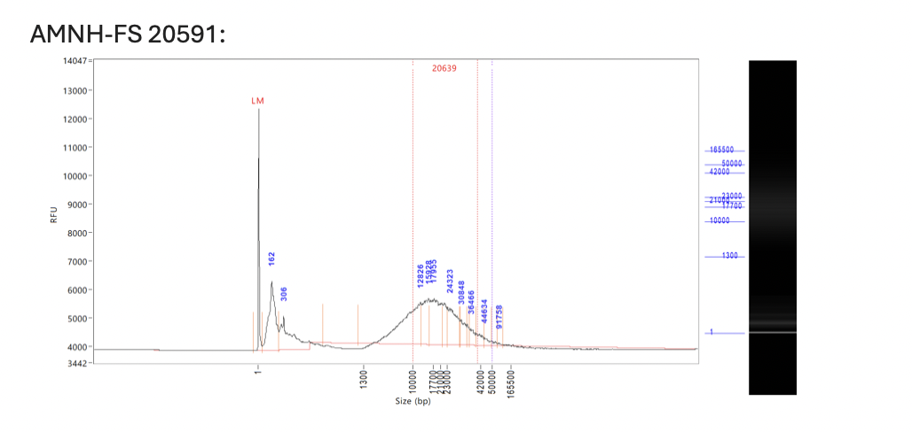
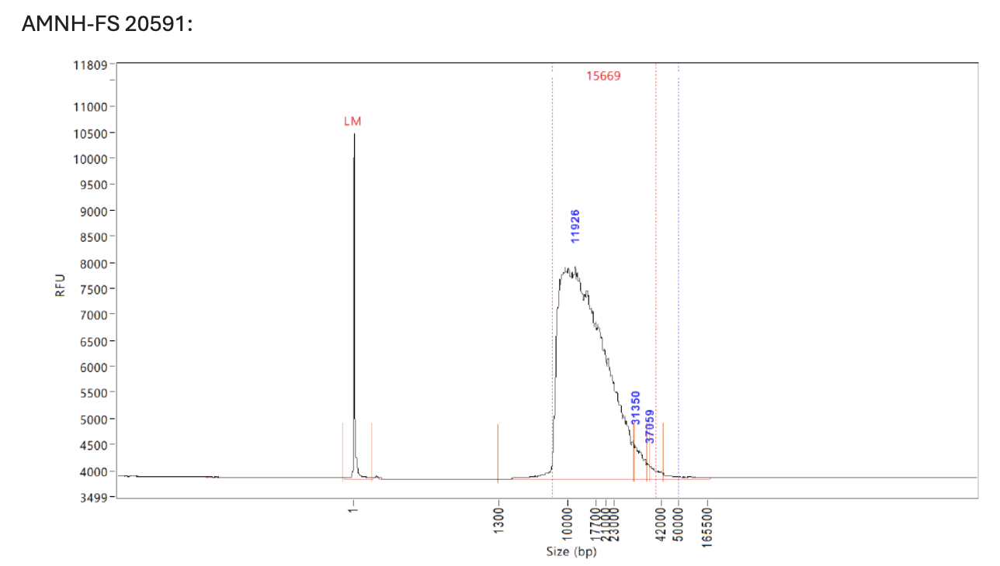
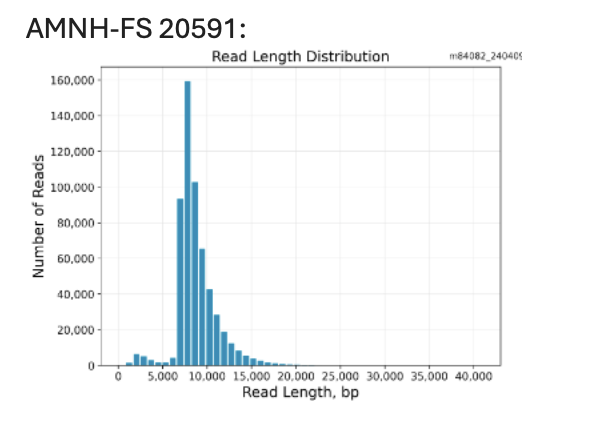

# **_Plestiodon fasciatus_ Long Read Genome Assembly**

Howdy.

This is a repository for the assembly of a _Plestiodon fasciatus_ genome from PacBio3 Revio Sequencing. This repository is modelled after Amanda Markee's [actias-luna-genome repository](https://github.com/amandamarkee/actias-luna-genome.git)

## **Sequencing Issues**

I had hoped that this new and expensive sequencing method would provide the data for a high quality reference genome. 
Unfortunately, the sequencing of this specimen came back very poorly--likely due to the preservation in Nucleic Acid Preservation buffer (NAP). 

Here are the stats:
- Yield (Gb): 4.98
- Read Length (kb): 8.71

This issue was not evident in the extraction and library stages--

Extraction QC:

LibraryQC:

However, looking at the read length distribution, something definitely went wrong during sequencing:

It appears as if the the system was only sequencing a subset of the library biased towards shorter reads.
The sequencng agency hypothesized that there may be something in the NAP buffer that binds to DNA and blocks the polymerase from passing. The binding agent would have to be fairly scattered, but abundant to the point that the longer reads are inevitably running into them. 

That is just a theory.

